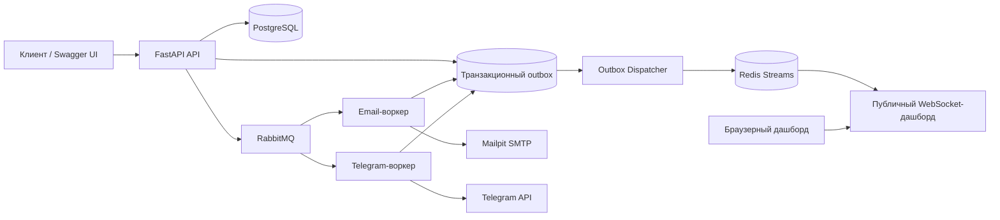

# Notification Service

Асинхронная платформа уведомлений с авторизацией, RabbitMQ-воркерами и дашбордом в реальном времени поверх Redis Streams.


`Notification Service` - портфолио-проект, приближенный к продакшен-подходу: сервис принимает уведомления от авторизованных пользователей, доставляет их через email/Telegram-воркеры и показывает публичный дашборд в реальном времени с безопасными событиями.

Проект демонстрирует:

- полноценный поток авторизации: регистрация, вход, ротация refresh token, выход, `/me`;
- транзакционный outbox для надежной публикации событий дашборда;
- RabbitMQ-воркеры для асинхронной доставки уведомлений;
- Redis Streams + WebSocket для восстановления событий дашборда;
- unit, integration и e2e тесты поверх реальной инфраструктуры.

## Архитектура



Основной поток: пользователь получает токены, отправляет уведомление от имени `current_user`, API пишет данные и outbox-событие в PostgreSQL, RabbitMQ-воркеры доставляют сообщения, outbox dispatcher публикует безопасные события в Redis Stream, а дашборд восстанавливает пропущенные события и получает новые через WebSocket.

## Возможности

- Регистрация, вход, refresh, выход и `/auth/me`.
- Защищенный notification API с владельцем из `current_user`.
- Доставка через email и Telegram.
- Публичный дашборд в реальном времени без утечки приватных данных.
- Переподключение и восстановление событий дашборда через Redis Stream IDs.
- Mailpit для локальной проверки email-доставки.
- RabbitMQ Management UI для просмотра очередей.

## API

### Авторизация

| Метод | Путь | Описание |
| --- | --- | --- |
| `POST` | `/api/v1/auth/register` | Создать пользователя и выдать токены |
| `POST` | `/api/v1/auth/login` | Войти через OAuth2-совместимую форму |
| `POST` | `/api/v1/auth/refresh` | Выпустить новую пару токенов и отозвать старый refresh token |
| `POST` | `/api/v1/auth/logout` | Отозвать refresh token |
| `GET` | `/api/v1/auth/me` | Вернуть текущего пользователя из JWT-токена доступа |

### Уведомления

| Метод | Путь | Описание |
| --- | --- | --- |
| `POST` | `/api/v1/notifications/send` | Создать notification от имени текущего пользователя |
| `GET` | `/api/v1/notifications/` | Получить notifications текущего пользователя |
| `GET` | `/api/v1/notifications/{id}` | Получить свое уведомление вместе с журналами доставки |

### Дашборд

| Метод | Путь | Описание |
| --- | --- | --- |
| `POST` | `/api/v1/ws/guest-ticket` | Выдать одноразовый тикет для дашборда |
| `WS` | `/api/v1/ws/dashboard?ticket=...&last_event_id=...` | Публичный поток событий для дашборда |

## Быстрый запуск

```bash
docker compose up -d --build
```

Полезные локальные URL:

| Сервис | URL |
| --- | --- |
| Swagger UI | `http://127.0.0.1:8000/docs` |
| Дашборд | `http://127.0.0.1:8000/static/index.html` |
| Mailpit | `http://127.0.0.1:8025` |
| RabbitMQ UI | `http://127.0.0.1:15672` |

Минимальный demo-сценарий: открыть Swagger, зарегистрировать пользователя, выполнить вход, авторизоваться через токен доступа, отправить уведомление, проверить письмо в Mailpit и посмотреть обновления доставки на дашборде.

## Тесты

Точечные проверки:

```bash
pytest tests/unit/test_security.py -q
pytest tests/e2e/test_auth_flow.py -q
pytest tests/e2e/test_notifications_flow.py -q
```

Полный набор:

```bash
pytest tests/ -q
```

Integration и e2e тесты рассчитаны на запуск с реальной инфраструктурой через Docker/testcontainers, а не на упрощенные in-memory замены.

## Безопасность

- Пароль никогда не хранится в базе данных в открытом виде.
- Refresh tokens хранятся только как HMAC-SHA256 хэши.
- JWT-токен доступа подписан, но не зашифрован, поэтому внутрь кладутся только безопасные claims.
- Публичные события дашборда не раскрывают `title`, `body`, email, Telegram ID, данные получателя и сырые ошибки провайдеров.
- Владелец уведомления берется из `current_user.id`; клиентский `user_id` в теле запроса отклоняется.
